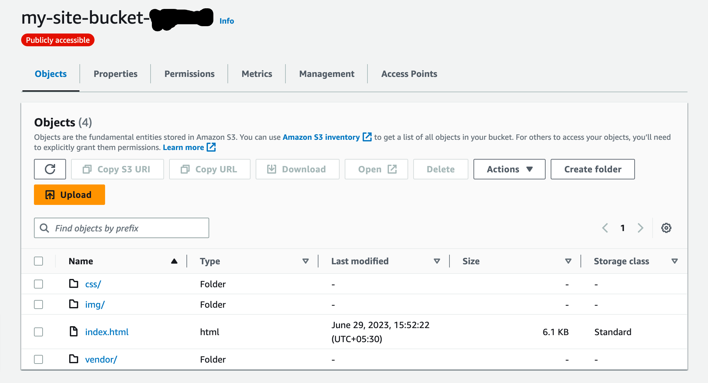

# Avinash's Travel Blog

A static website deployed on AWS using S3, CloudFront, and IAM.

## S3

### S3 Bucket Contents

### S3 Bucket IAM Configurations
The S3 bucket has an IAM bucket policy that makes the bucket contents publicly accessible.

### S3 Bucket Hosting Config

## CloudFront Configuration

### CloudFront Distribution Details

## Website URLs
- CloudFront URL: [https://d1vq4fzw7jresq.cloudfront.net](https://d1vq4fzw7jresq.cloudfront.net)